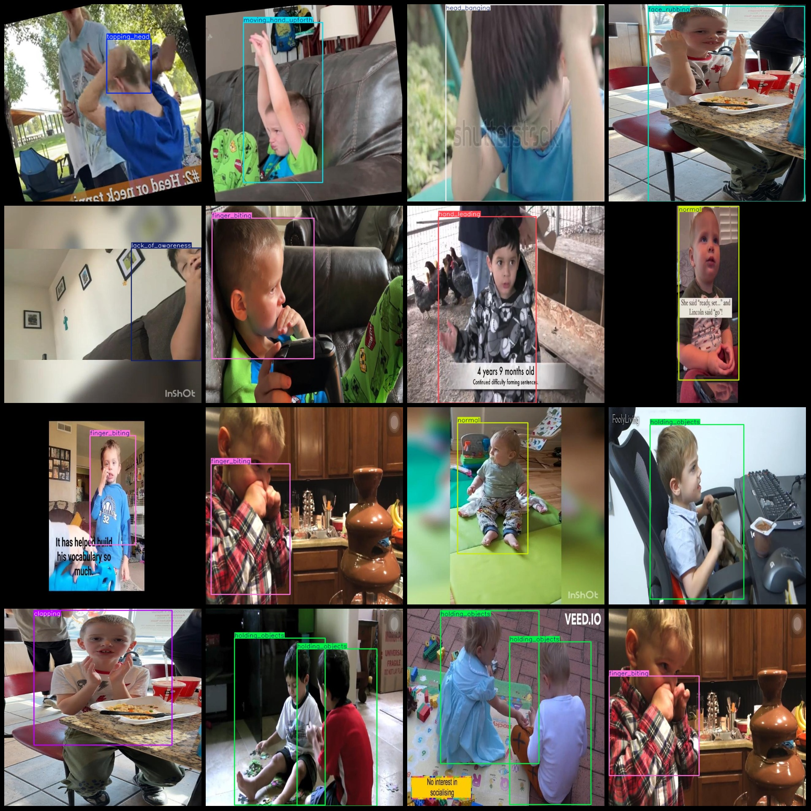
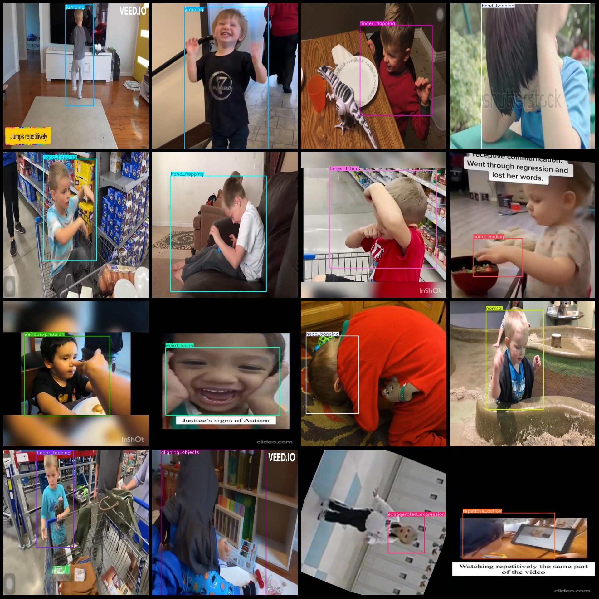

# Autism Spectrum Disorder Behavior Detection Dataset in VOC+YOLO Format with Enhanced Features for 5248 Images and 34 Classes

Please be aware that the dataset contains many "duplicate" images, which are mainly caused by video frame extraction. These images appear as duplicates. Additionally, there are some rotation augmentation images in the dataset.

The format of the dataset is Pascal VOC format plus YOLO format (excluding the segmentation path's txt file, only containing jpg image and the corresponding VOC format xml file and YOLO format txt file).
number of images: 5248  
annotation count: 5248  
annotation count: 5248  
annotationnumber of classes: 34  
Annotation class names (note that the order in YOLO format does not correspond to this, but is based on labelsfile/classes.txt): ["Lack_social_skill", "Stimming", "aligning_objects", "avoid_eye_contact", "awkward_posture", "clapping", "closing_eyes", "continuous_moving"]
"exaggerated_expression","face_rubbing","finger_biting","finger_flapping","finger_smelling","finger_tapping","hand_flapping","hand_leading","head_banging","holding_objects","jumping",
"lack_of_awareness","lack_of_response","moving_hand_upforth","normal","repetitive_action","rocking","rubbing_eyes","rubbing_hands","rubbing_nose","rubbing_objects","smelling","spinning",
"tapping_head","weird_expression","weird_laugh"]  
boxes per class:   
The "Lack_social_skill" box has a count of 213.
Stimming (stereotyped stimulus behavior) frame count = 186
Aligning Objects: box count = 153
Avoiding Eye Contact: box count = 225
This is a sarcastic way of saying that something is not very good or impressive.
The number of clapping sounds in the box is 103.

box count = 140
Number of continuous moving boxes = 185
Exaggerated Expression (Over-expression) box count = 216
Face Rubbing (Rubbing Face) box count = 110
Finger Biting (Biting Finger) box count = 220
Finger Flapping (Flapping Fingers) box count = 234
Finger-smelling = 70
Finger tapping (finger tap) = 64
Hand flapping box count = 281
Hand Leading (hand_leading) frame count = 181
The number of heads being banged is 184.
Number of holding objects = 281
Jumping box count = 199
"Lack of awareness" is translated to "lack of awareness" in English. The number 201 is not included in the translation.
"Lack of response" box count = 97
Moving hand up and down (box count = 164)
normal box count = 265
Repetitive Action (Repeating Action) Box Count = 225
Rocking frame count = 106
rubbing_eyes box count = 58
The rubbing_hands() function is used to simulate the act of rubbing hands together. The box count parameter is not a standard part of this function, and it's unclear what it refers to in context. If you could provide more information about the context or the purpose of using this function, I might be able to assist you better.
"rubbing_nose" is a verb that means "to rub one's nose". The number 39 is a frame count, which is a unit of measurement for the amount of text in a document.
Rubbing objects = 67
Smelling Frame Count = 44
Number of frames = 102
Tapping head (36 boxes)  
Weird expression (226 boxes)  
Weird laugh (189 boxes)
total boxes: 5384  
images per class:   
Lack of social skills images = 209
Stimming (stereotyped stimulus behavior) = 186
Aligning objects (aligning_objects) has 153 images.
Avoid eye contact (224 images)
Clapping (103 images)
Weak posture (242 images)
Closing Eyes (Closed Eyes) 
Occupying Image Count = 138
Continuous moving images = 185
"Exaggerated expression" is a slang term for a person who exaggerates their emotions or behavior. It's often used to describe someone who is overly dramatic, dramatic, or dramatic. The number 216 could refer to the number of times this expression has been used in an image or video, but it's not clear from the given information what context it's being used in.
images = 110  
images = 220  
images = 234  
images = 70  
"finger_tapping" is translated to "finger tapping".

The number of pictures owned by this user is 64.
Hand Flapping (hand-flapping) images = 281
Hand Leading (hand-leading) images = 181
Head Banging (head-banging) images = 184
Holding Objects (holding objects) occupancy = 237
Jumping (jumping) images = 199
Lack of Awareness (lack-of-awareness) images = 201
Lack of response (lack_of_response) has 93 images.
Moving hand up and down (hand movement) images = 164
Normal (normal) images = 265
Repetitive action (repeated action) images = 224
Rocking (rocking body) images = 104
Rubbing eyes (rubbing eyes) images = 58
Rubbing hands (scratching hands) images = 73
Rubbing nose (rubbing nose) images = 39
Rubbing objects (scratching objects) images = 67
Smelling = 42
spinning images = 101
tapping_head images = 35
weird_expression images = 223
weird_laugh images = 188
## Images

Here is a pay link on Stripe ( https://buy.stripe.com/3cs8yP7sY87d0vu9AB ). Please contact me lonlonago@foxmail.com after funding $89, and I will send you a complete data files , thank you!

